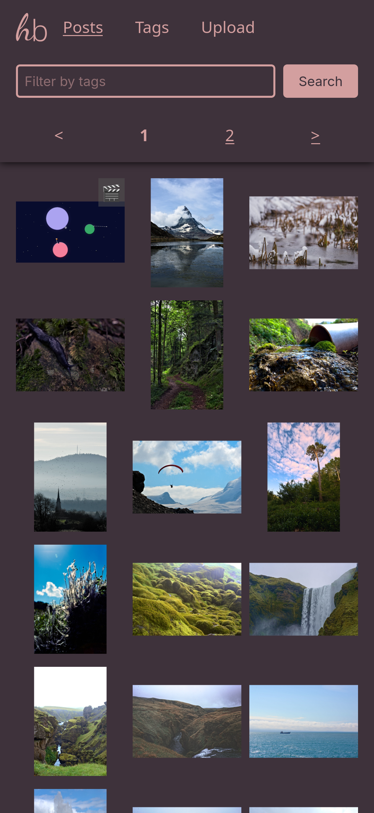
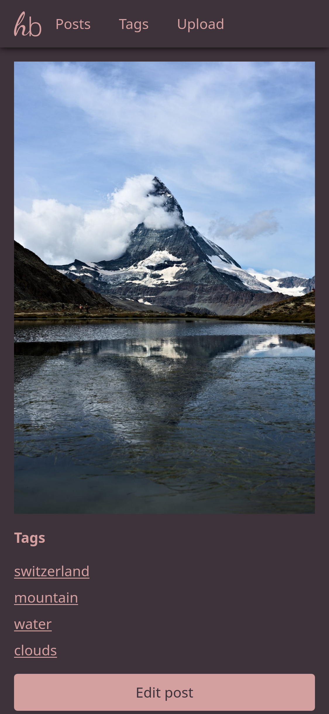
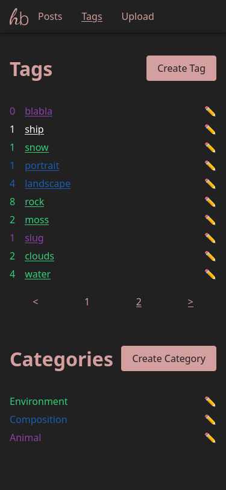
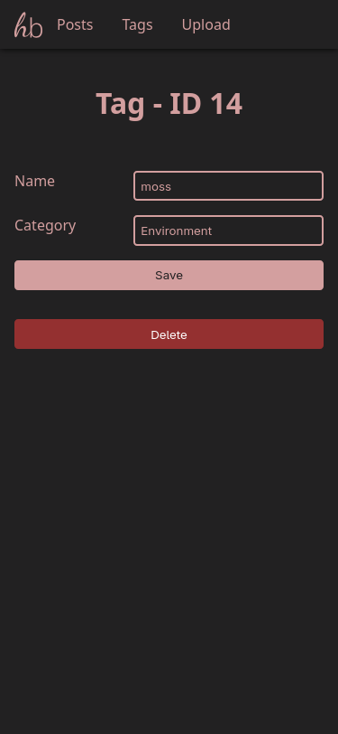
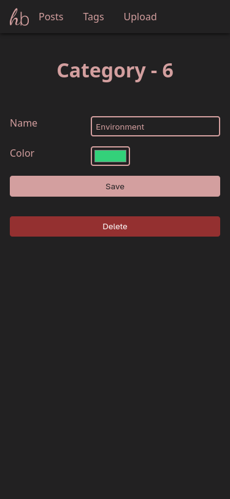
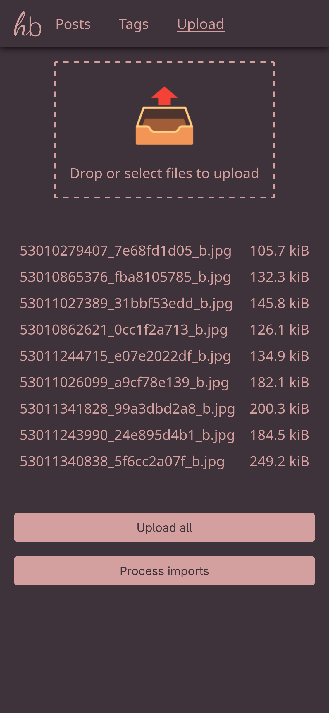

# homebooru
A booru-style image board focused on simple data storage (no databases or other additional services, just files).

<div align="center">
    
    
    
    
    
    
</div>

## Installation
I created an install script to automatically install everything. It fetches the current GitHub release (alternatively you can modify it to use a local release archive) and
- creates a user and group with which the backend runs
- install the backend to `/opt/homebooru`
- install the frontend to `/srv/www/homebooru`
- save posts etc. in `/mnt`
- set up nginx as the webserver
- set up and start a systemd service to run the backend server

This script was mainly created for use in a LXC container in Proxmox (with another disk mounted to `/mnt`).

Just run the following as root:

``` sh
wget -q -O - https://raw.githubusercontent.com/Danksa/homebooru/refs/heads/main/install | bash
```

or, if you use curl:
``` sh
curl -sSL https://raw.githubusercontent.com/Danksa/homebooru/refs/heads/main/install | bash
```

You can also clone this repo/download just the `install` script and modify it to change some directories, if needed.

> [!NOTE]
> The system is required to have `npm`, `nodejs`, `nginx`, `wget`, `tar`, `ffmpeg` and `imagemagick` installed already
> I've tested this with `ffmpeg` version 7.1.1 and `imagemagick` version 7.1.1, older versions probably work as well.

## Updating
The `update` script will update your homebooru by:
- detecting the user and group to use from the owner of the backend directory (`/opt/homebooru` by default)
- downloading the latest GitHub release
- updating the backend and frontend files
- transferring the settings of your old frontend `config.js` to the new one. (a copy of your old config will be created as `config.js.bak`, if anything goes wrong)
- restarting the backend

To update your homebooru you can use the `update` script pretty much like you use the `install` script:
``` sh
wget -q -O - https://raw.githubusercontent.com/Danksa/homebooru/refs/heads/main/update | bash
```

if you use non-default directories for your frontend or backend, supply them as environment variables:
``` sh
wget -q -O - https://raw.githubusercontent.com/Danksa/homebooru/refs/heads/main/update | FRONTEND_DIR="/srv/somewhere" BACKEND_DIR="/usr/local/somewhere" bash
```

## Features
- Uploading images and videos (now with progress bars!)
- Importing images and videos from a local server directory
- Tagging posts
- Searching for posts by which tags they have (or don't have)
- Display posts (obviously!)
- Mass-tagging posts
- Tag categories

### Planned
- Tag aliases
- Tag merging
- Tag implications
- Slideshows

### Currently not Planned
- Duplicate detection
- Uploading files directly from other sites
- Automatic AI-based tagging

## Development
To start the development build just clone this directory, install the backend dependencies via npm:
```
npm install
```

and symlink the `backend/data` directory for the frontend:
```
ln -s ../backend/data ./frontend/data
```

Afterwards you can simply run `npm run start` to start the backend.
For the frontend you'll need some webserver, like [http-server](https://www.npmjs.com/package/http-server).

Then open http://localhost/ and you should be good to go!

### Creating a Release Archive
To build an archive to later install using the install script simply run the `build` command. It will extract the version from the backend `package.json` and create an archive named `homebooru-v<VERSION>.tar.gz` inside the `package` folder.

## How does it work?
This project consists of two components:
- A backend written in Typescript, running in NodeJS (I know, I'm sorry)
- A static frontend written in plain HTML/CSS/JS, which can be hosted by a webserver of your choice

For more details, check out the [frontend readme](frontend/README.md) and [backend readme](backend/README.md).

## Disclaimer
The logo was created using the fonts `Dancing Script` and `Noto Sans`.
