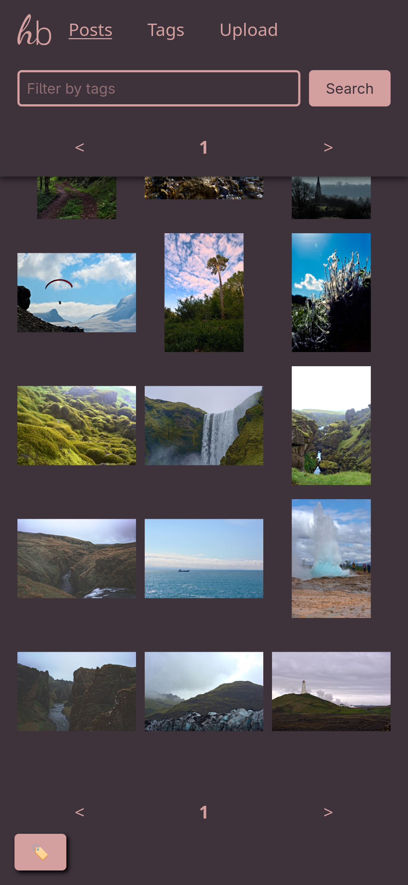
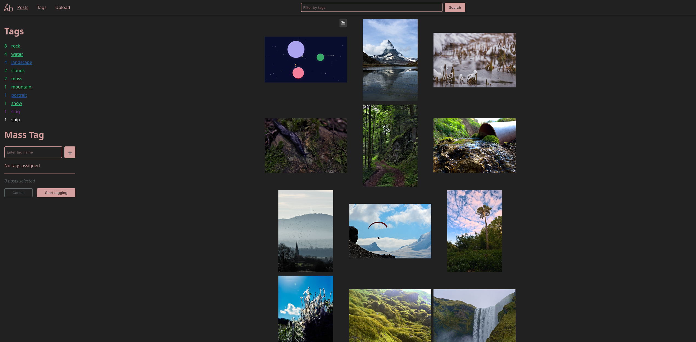
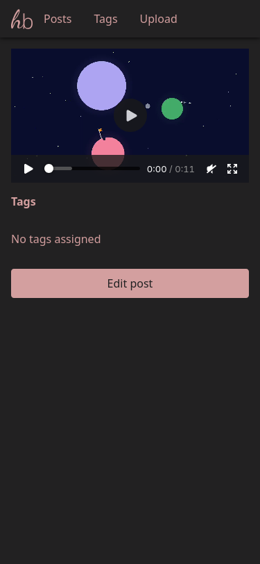
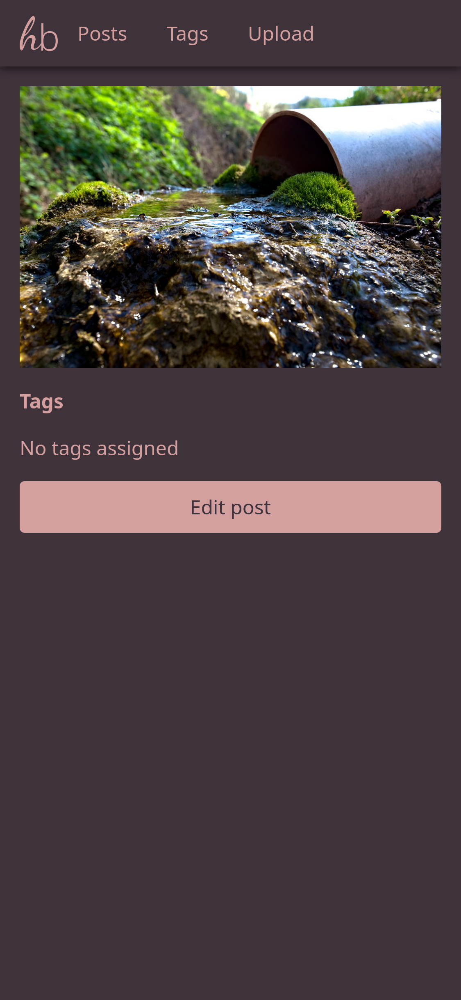
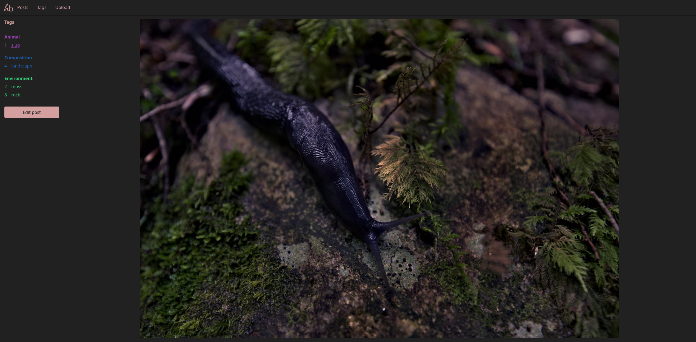
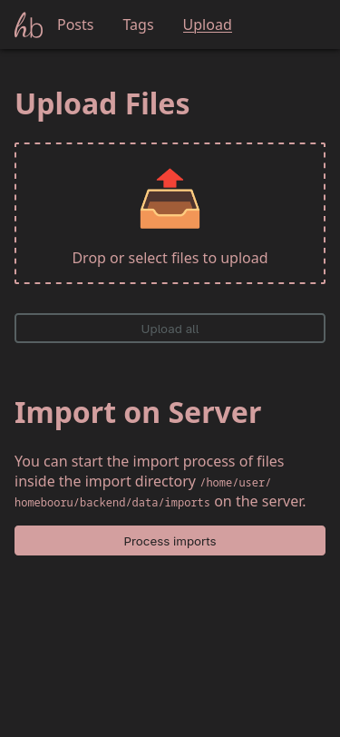

# homebooru

## Why does this exist?
I wanted to host my own internal booru-style image board, but other projects like [danbooru](https://github.com/danbooru/danbooru) or [szurubooru](https://github.com/rr-/szurubooru) (which I've used happily for many years!) are either a pain to set up or have many dependencies like redis, databases etc. (and I don't use the docker because I'm an idiot, which makes it harder still).

So the goal with this project is to have as few dependencies to other things like databases as possible to make backing up easier (especially for my friends who are much less versed in this stuff). Being ment for internal use also means that there is no concept of users at all, anyone can just upload, edit and delete posts.

## What does it do?
Currently homebooru supports:
- Uploading images and videos (now with progress bars!)
- Importing images and videos from local server directory
- Tagging posts
- Searching for posts by tags
- Display posts (obviously!)
- Mass-tagging posts
- Tag categories

## Next goals
- Show most frequent tags on posts page
- Tag aliases

## What does it not do? (for now)
- Duplicate detection
- Tag implications

## Requirements
The backend server needs:
- `ffmpeg` (tested with version 7.1.1). It's used to generate thumbnails for videos, so older versions are probably working as long as the CLI arguments haven't changed.
- `imagemagick` (tested with version 7.1.1). Also used for thumbnail generation. As with `ffmpeg` older versions probably work as well.
- `node` (tested with v20)

The frontend requires any static webserver of your choosing.

## Screenshots

### Browsing posts

### Viewing a post

### Uploading

### Browsing tags

## Installation
I added an installation script which will install the backend and frontend on the same machine, using `nginx` as the HTTP server. The `$DATA` (see [backend readme](backend/README.md) for details) path is set to `/mnt` by default, it can be changed if you edit the `install` file.

The backend will be put in `/opt/homebooru` and the static frontend files in `/srv/www/homebooru`. You can change them by editing the `install` file.

A systemd unit is used to automatically start the backend.

## How does it work?
This project consists of two components:
- A backend written in Typescript, running in NodeJS (I know, I'm sorry)
- A static frontend written in plain HTML/CSS/JS, which can be hosted by a webserver of your choice

For more details, check out the [frontend readme](frontend/README.md) and [backend readme](backend/README.md).

## Disclaimer
The logo was created using the fonts `Dancing Script` and `Noto Sans`.
